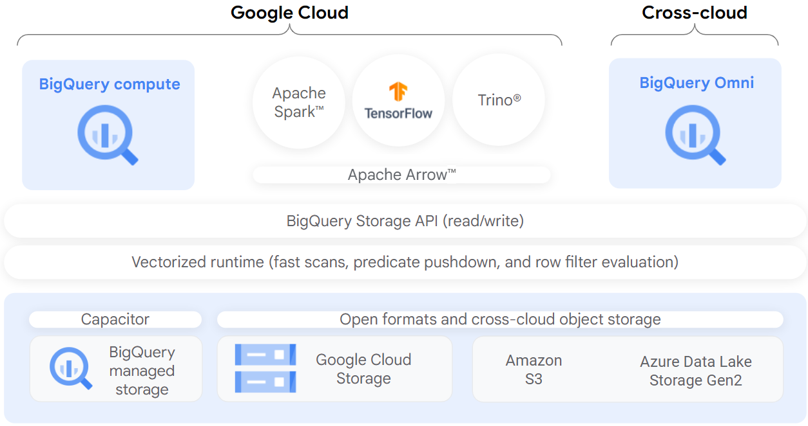

BigLake is a unified storage engine that simplifies data access for data warehouses and lakes by providing uniform fine-grained access control across multi-cloud storage and open formats.

BigLake extends BigQuery's fine-grained row- and column-level security to tables on data resident object stores such as Amazon S3, Azure Data Lake Storage Gen2, and Google Cloud Storage. BigLake decouples access to the table from the underlying cloud storage data through access delegation. This feature helps you to securely grant row- and column-level access to users and pipelines in your organization without providing them full access to the table.

After you create a BigLake table, you can query it like other BigQuery tables. BigQuery enforces row- and column-level access controls, and every user sees only the slice of data that they are authorized to see. Governance policies are enforced on all access to the data through BigQuery APIs. For example, the BigQuery Storage API lets users access authorized data using open source query engines such as Apache Spark, as the following diagram shows:

BigLake 到底是干嘛的？（人话版）
BigLake 就是在数据湖（GCS/S3/ADLS）和数据仓库（BigQuery）之间，加了一层 “统一的、安全的、高速的访问层”，让：
一份数据，到处用，不用搬
数据就存在 GCS / S3 / ADLS 上（开放格式：Parquet、Iceberg、ORC）。
BigQuery、Spark、Flink、Presto、AI 模型，都能直接读同一份数据，不用复制、不用 ETL 搬来搬去。
统一管权限，细到 “行和列”
以前数据湖只能给 “整个桶 / 文件夹” 权限，现在 BigLake 让你像管 BigQuery 表一样：
张三只能看华东区的行
李四不能看 “手机号” 这一列
不管是用 BigQuery SQL 查，还是用 Spark 跑，权限都统一生效。
多云数据，也能统一管、统一查
数据在 AWS S3、Azure Data Lake 上，BigLake 也能把它们 “拉进” BigQuery 体系，不用把数据搬到 GCP。
一套 SQL、一套权限、一套治理，管所有云的数据。
让数据湖像数据仓库一样快、一样稳
BigLake 给开放格式（Iceberg、Parquet）加了 BigQuery 级别的缓存、索引、查询优化，查湖数据不再慢得要死。
支持 ACID、事务、数据更新，湖不再是 “只能写不能改” 的死数据。
为 AI 铺路：结构化 + 非结构化数据一起用
BigLake 能管结构化表，也能管图片、视频、文档等非结构化数据。
BigQuery ML、Gemini 等 AI 工具可以直接在 BigLake 上跑，不用先把数据导来导去。

Vertex AI

