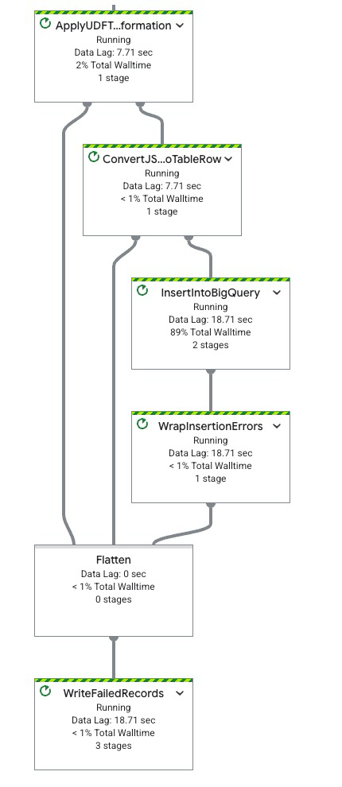

2. 这个实验到底强行想教啥（人话极简版）
整条链路就一件事：
本地 / 文件 CSV → Dataflow（流式实时管道）→ BigQuery 实时入库 → SQL 分钟级聚合 → Looker 实时监控大屏
用来模拟：
网约车 / 外卖 / 金融交易 这种不断新增的流式数据，实时进数仓、实时看报表。
用到组件：
GCS：放原始 CSV、脚本、配置文件
Dataflow：流式 ETL 清洗转发
BigQuery：落地存储 + 实时计算
Looker Studio：做在线可视化看板

