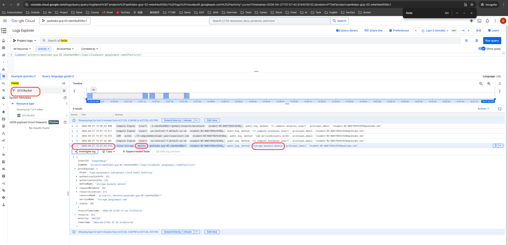

Label Project ID 1 as Monitoring Project.
qwiklabs-gcp-00-95004c8a05d9

Label Project ID 2 as Worker 1.
qwiklabs-gcp-01-57c9c9348d17

Label Project ID 3 as Worker 2.
qwiklabs-gcp-02-b060d13342aa

worker-1-server 
http://34.24.248.6/
URL=http://34.24.248.6

worker-2-server 
http://136.117.153.168/

frontend-servers-uptime
Check ID
frontend-servers-uptime-ogUHfkV-Ios

## audit log monitor
34.23.90.15

