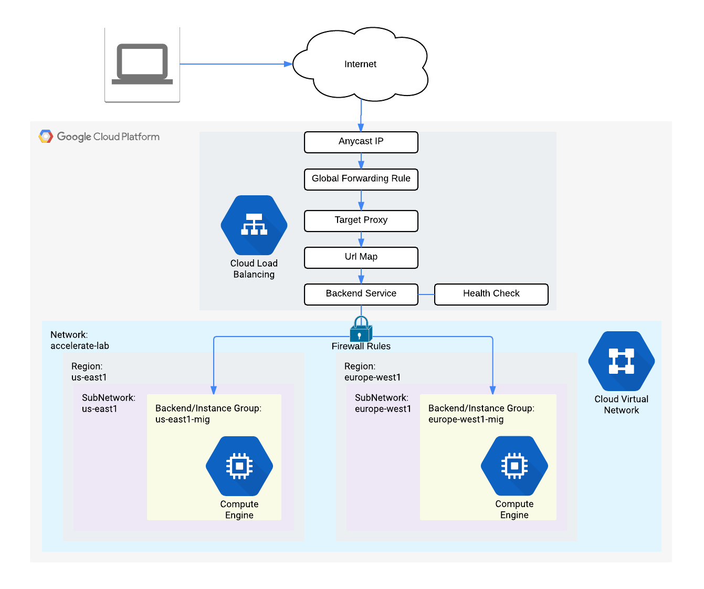

二、核心组件拆解（按图中顺序）
1. 入口层：Anycast IP（任播 IP）
作用：全球统一的入口 IP，用户无论在哪个地区，都会自动被路由到最近的 Google 边缘节点（PoP）。
优势：天然实现就近接入，降低延迟，同时隐藏后端真实 IP，提升安全性。
2. 转发层：Global Forwarding Rule（全局转发规则）
作用：将用户流量转发到对应的负载均衡代理，是入口流量的 “分发器”。
关键：它是全局资源，不绑定特定区域，支持跨所有 Google 边缘节点。
3. 代理层：Target Proxy（目标代理）
作用：负责终止用户的 HTTP/HTTPS 连接，处理 TLS/SSL 加密解密，再将请求转发给 URL 映射模块。
补充：如果是 HTTPS 负载均衡，这里会绑定你的 SSL 证书。
4. 路由层：Url Map（URL 映射）
作用：基于请求的 URL 路径、主机名，将流量分发到不同的后端服务。
举例：可以把 /api 流量发给后端 A，/static 流量发给后端 B，实现精细化路由。
5. 服务层：Backend Service（后端服务）
核心：连接负载均衡和实际后端实例的 “桥梁”，同时包含健康检查逻辑。
健康检查（Health Check）：持续监控后端实例状态，只把流量发给健康的节点，故障节点会被自动剔除。
6. 后端层：跨区域实例组
图中包含两个跨区域后端：
us-east1-mig（美国东部）
europe-west1-mig（欧洲西部）
逻辑：Backend Service 会自动根据用户位置、实例健康状态、延迟，选择最优的后端区域转发请求。
7. 安全层：Firewall Rules（防火墙规则）
作用：只允许来自负载均衡健康检查和转发流量的请求进入后端 VPC，拒绝所有外部直连。
价值：后端实例不需要公网 IP，也不会直接暴露在互联网上，大幅降低被攻击的风险。

34.117.59.85:80
	[2600:1901:0:ec4f::]:80	

export LB_IP=34.117.59.85

34.69.187.188

