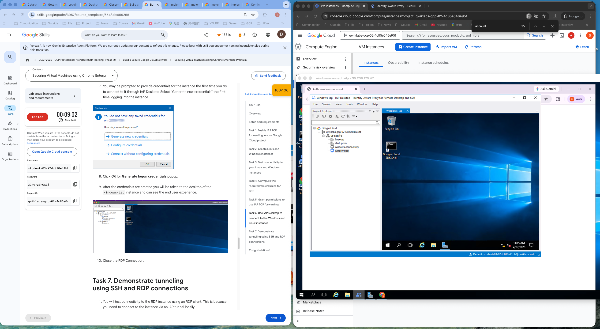
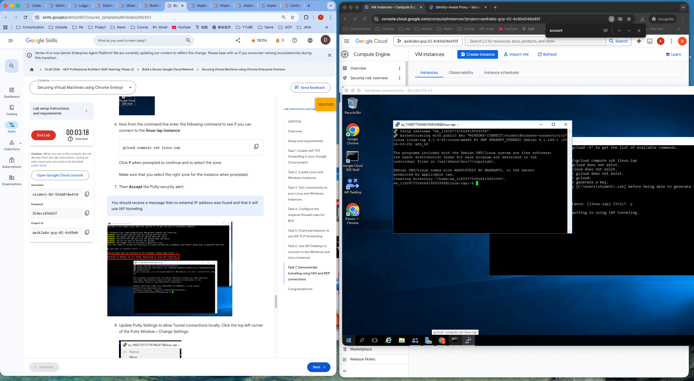

三、工作原理（极简版）
以你实验里的 IAP TCP 转发（SSH/RDP） 为例：
你本地运行：
bash
运行
gcloud compute ssh 用户名@VM名 --tunnel-through-iap
流量不直接连 VM，而是先连到 Google 的 IAP 全球节点
IAP 先做 身份认证：用你的 Google 账号登录
再做 权限检查：看你有没有这个 VM 的 IAP 权限
全部通过 → IAP 通过 Google 内网专线，把流量转发到 VM 的 22/3389 端口
VM 只需要放行 IAP 的内网 IP 段，不用放外网
一句话：IAP 是 Google 帮你开的一条加密内网隧道，只给有权限的人用。

gcloud compute start-iap-tunnel windows-iap 3389 --local-host-port=localhost:0  --zone=us-east4-b

SSH：Linux/Unix 系统的「命令行远程工具」，纯文字、轻量、安全，主要用来管理服务器。
RDP：Windows 系统的「图形界面远程桌面」，和直接坐在电脑前操作一模一样，有完整的窗口、鼠标、图形界面。

对比项	SSH (Secure Shell)	RDP (Remote Desktop Protocol)
系统	主要用于 Linux / Unix /macOS	主要用于 Windows
界面	纯命令行，没有图形	完整图形界面，和本地桌面一样
典型用途	服务器运维、执行命令、写脚本	远程操作 Windows 软件、图形化管理
端口	默认 22	默认 3389
带宽占用	极低，几 KB/s 就能跑	较高，会传输图像、鼠标操作
安全性	自带加密（SSH 密钥 / 密码）	依赖网络加密（TLS/SSL），本身协议历史上有漏洞
使用场景	无公网 IP 的服务器、云主机	Windows 桌面、图形化应用

IAP：更像是「轻量化的零信任门禁」，帮你安全地连接云里的服务器，运维工具属性更强。
Citrix：更像是「完整的企业级应用分发平台」，帮你把整个桌面和应用打包交付给用户，虚拟化平台属性更强。

维度	Google IAP	Citrix (Workspace/NetScaler)
定位	零信任访问代理，核心是「身份优先」	完整的应用交付平台，偏「桌面 / 应用虚拟化」
部署方式	云原生、全托管，GCP 内置服务，开箱即用	企业级软件，需要本地部署 / 混合云部署，架构复杂
适用场景	云原生、微服务、GCP 环境的轻量远程运维	传统企业、大型机构，需要集中交付桌面 / 应用
访问对象	主要是 GCP 上的 VM、API 等基础设施	完整的 Windows 桌面、企业应用（ERP、OA 等）
客户端体验	轻量：命令行（gcloud）或 IAP Desktop 工具	重：专用 Citrix Receiver/Workspace 客户端
成本	按需付费，按流量 / 访问次数计费	按用户 / 服务器授权，前期成本高

## IAP Lab II
GSP499 实验核心知识点总结（精简、应试 + 工作两用）
实验名称：User Authentication: Identity-Aware Proxy（IAP 用户身份认证）
一、核心概念
IAP 身份感知代理
GCP 零信任网关，不依赖防火墙、公网 IP、VPN
拦截所有访问应用 / 资源的请求，先做谷歌身份认证 + 权限校验，合法用户才放行
核心价值：统一鉴权、外网不暴露服务、轻量化安全管控
OAuth Consent Screen
IAP 前置依赖配置
对内 / 对外应用授权弹窗配置，IAP 启用必须先完成该页面创建
内部应用（Internal）仅组织内账号可登录
App Engine（GAE）
GCP 无服务托管应用平台，本次实验承载 Web 服务
分为 Standard / Flexible 两种环境，IAP 需禁用 Flex 避免权限报错
二、实验三大核心任务 & 知识点
Task 1：部署 App Engine + 开启 IAP 访问限制
基于 Python/Flask 部署最简 Web 应用
启用 IAP API、配置 OAuth 同意页
关闭 App Engine Flex API，解决 IAP 冲突
开启 IAP 保护应用：
默认全员禁止访问
通过 IAP-secured Web App User 角色，手动添加授权账号
效果：未授权账号直接拒绝访问，替代应用自身登录逻辑
Task 2：获取 IAP 传递的用户身份
IAP 认证通过后，自动在请求头带入用户信息：
X-Goog-Authenticated-User-Email 登录邮箱
X-Goog-Authenticated-User-ID 谷歌唯一用户 ID
应用直接读取请求头，即可实现免开发登录、展示用户信息
重大风险：
关闭 IAP 后，请求头可被手动伪造（伪造邮箱）
纯 Header 明文传递不安全，容易身份欺骗
Task 3：IAP 身份加密校验（生产关键）
IAP 提供安全头：X-Goog-IAP-JWT-Assertion
本质：ES256 加密签名 JWT 令牌，由谷歌私钥签发
应用通过谷歌公钥验签，杜绝伪造
即使 IAP 被关闭 / 绕过，伪造的 Header 无法通过签名校验
企业生产必备：JWT 密码学验证 = 防篡改、防冒充
三、高频考点 / 面试要点
IAP 核心架构：请求拦截 → 身份认证 → 权限校验 → 透传请求 + 用户信息
两种身份传递方式
明文 Header：简单、低安全、可伪造
JWT 签名令牌：加密验签、高安全、生产标准
IAP 权限模型
资源级授权（单个 App/VM 单独管控）
角色：IAP-secured Web App User 网页应用专属权限
适用场景
内网 Web 系统、后台管理页、内部工具
无需改造代码，快速实现零信任访问
四、关键命令 & 关键文件
部署：gcloud app deploy
打开应用：gcloud app browse
禁用冲突 API：gcloud services disable appengineflex.googleapis.com
核心依赖头：
明文：X-Goog-Authenticated-User-Email
加密：X-Goog-IAP-JWT-Assertion
验签算法：ES256
五、一句话总览
IAP = GCP 原生零信任准入控制
对外隐藏服务
统一账号登录
轻量权限管控
简单场景用明文 Header，敏感业务必须 JWT 加密验签
无需 VPN、无需改业务代码，快速加固内网 / 云上应用安全

